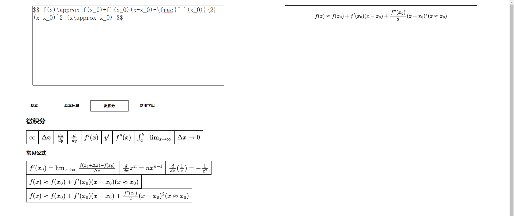

# LaTeX Type: an Easier Way to Type LaTeX Formulas
> LaTeX Type: 一种输入LaTeX公式的简单方式
## Program Languages used(including libraries)
> 使用的编程语言(包括库)
- HTML5
- Javascript
- JQuery v2.0.0
- MathJax-3.2.0
## Online Demo
> 在线演示   

[https://oscarxsb.github.io/LaTeX-Type/index.html](https://oscarxsb.github.io/LaTeX-Type/index.html)

